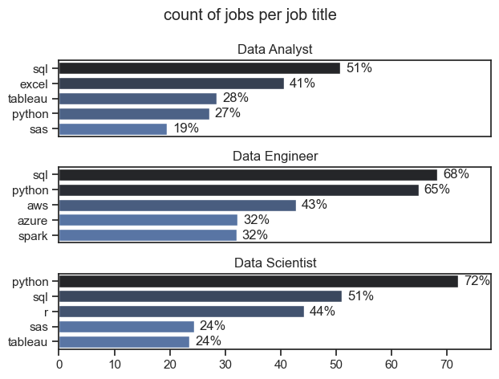
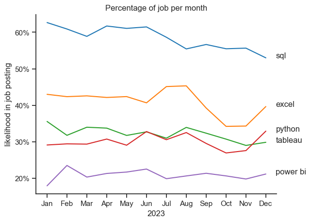
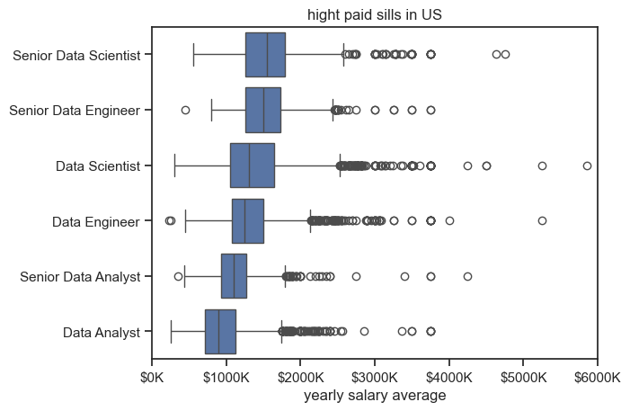
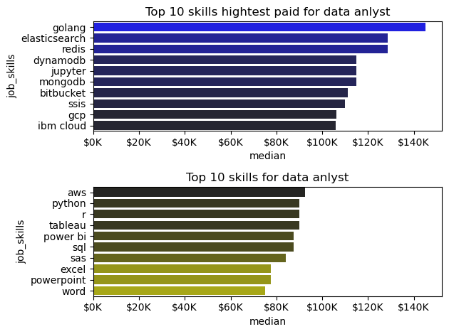
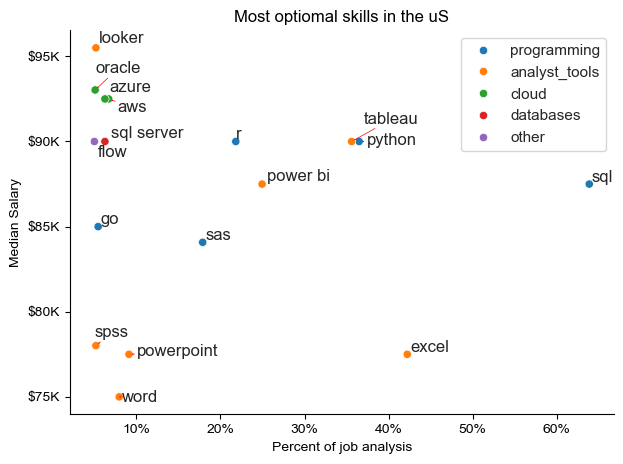

# The analysis

## Here is th readme for the top demandskill for data analyst

view my book here: [skills_count.ipynb](Job_Project/skills_count.ipynb)

visualize data:
```python
fig, ax = plt.subplots(len(job_titles), 1)
sns.set_theme(style ='ticks')

for i, jobtitle in enumerate(job_titles):
    df_plot = df_skills_percent[df_skills_percent['job_title_short']==jobtitle].head()
    sns.barplot(data= df_plot, y='job_skills', x='skill_percent',ax = ax[i],  hue='skill_count', palette = 'dark:b_r')
    ax[i].set_title(jobtitle)
    ax[i].set_ylabel('')
    ax[i].set_xlabel('')
    ax[i].get_legend().remove()
    ax[i].set_xlim(0,78)
    ax[i].legend().set_visible(False)
    for n,v in enumerate(df_plot['skill_percent']):
        ax[i].text(v +1,n,f'{v:.0f}%', va='center')
    if i!=len(job_titles)-1:
        ax[i].set_xticks([])
fig.suptitle('count of jobs per job title')
plt.tight_layout()

plt.show()

```

### Reults



### insights
python is a versatile skill and highly demanded for allthe roles that we did analysis


## 2. How are indemand skills trending for data alysts?
``` python
df_plot = df_DA_percent.iloc[:, :5]

sns.lineplot(df_plot, dashes = False, palette = 'tab10')
sns.set_theme(style='ticks')
sns.despine()
plt.title('Percentage of job per month')
plt.ylabel('likelihood in job posting')
plt.xlabel('2023')
plt.legend().remove()
ax = plt.gca()
from matplotlib.ticker import PercentFormatter
ax.yaxis.set_major_formatter(PercentFormatter(decimals=0))
for i in range(5):
    plt.text(11.5, df_plot.iloc[-1, i], df_plot.columns[i])

plt.show()
```




## how stkills were paid in US for the data analysts?

### salary analysis for data nerds were

``` python
sns.boxplot(data= df_US_top6, x='salary_year_avg', y = 'job_title_short', order = job_order)
sns.set_theme(style = 'ticks')

plt.title('hight paid sills in US')
plt.xlabel('yearly salary average')
plt.ylabel('')
plt.xlim(0,600000)
ticks_x = plt.FuncFormatter(lambda y, pos: f'${int(y/100)}K')
plt.gca().xaxis.set_major_formatter(ticks_x)
plt.show()

```



*Box plot visualizing for the data alysis which skill is having the best pay scale*


## 4. top high paying skills vs which skills arehaving the highest jobs 

```python
fig, ax = plt.subplots(2,1)

#df_DA_US_top.plot(kind = 'barh', y='median', ax=ax[0])
sns.barplot(data = df_DA_top_pay, x='median', y= df_DA_top_pay.index, ax = ax[0], hue='median', palette='dark:b')
#ax[0].invert_yaxis()
ax[0].xaxis.set_major_formatter(plt.FuncFormatter(lambda x, _: f'${int(x/1000)}K'))
ax[0].legend().remove()


#df_DA_US_topskills[::-1].plot(kind= 'barh', y='median', ax=ax[1])
sns.barplot(data = df_DA_topskills, x='median', y= df_DA_topskills.index, ax = ax[1], hue='median', palette='dark:y_r')
#ax[1].invert_yaxis()
#ax= ax.gca()
ax[1].xaxis.set_major_formatter(plt.FuncFormatter(lambda x, _: f'${int(x/1000)}K'))
ax[1].set_xlim(ax[0].get_xlim())
ax[0].set_title('Top 10 skills hightest paid for data anlyst')
ax[1].set_title('Top 10 skills for data anlyst')
ax[1].legend().remove()

plt.tight_layout()
#plt.xlim(0, 200000)

```




*Top 10 highest paid skills and top 10 kills for data anlyst*


## find the best optimal skills based on the technology

```python
from adjustText import adjust_text
from matplotlib.ticker import PercentFormatter

#fig , ax = plt.subplots()
#df_plot.plot(kind='scatter', x='skill_percent', y='median_salary')

sns.scatterplot(
    data = df_plot,
    x='skill_percent',
    y='median_salary',
    hue ='technology'
)
sns.set_theme(style='ticks')
sns.despine()
text =[]

for i, txt in enumerate(df_DA_skillstop.index):
    text.append(plt.text(df_DA_skillstop['skill_percent'][i], df_DA_skillstop['median_salary'][i], txt))
adjust_text(text,
            arrowprops=dict(arrowstyle='->', color='red', linewidth=0.5))
#ax.yaxis.set_major_formatter(plt.FuncFormatter(lambda x, loc: "${:,}K".format(int(x/1000))))
    #adjust_text([plt.text(df_DA_skillstop['skill_percent'][i], df_DA_skillstop['median_salary'][i], txt, fontsize=9) 
                # for i, txt in enumerate(df_DA_skillstop.index)],
            #arrowprops=dict(arrowstyle='->', color='red'))
#plt.text(50000,90000,"bhp", fontsize=9)
ax = plt.gca()
ax.yaxis.set_major_formatter(plt.FuncFormatter(lambda x, _: f'${int(x/1000)}K'))
ax.xaxis.set_major_formatter(PercentFormatter(decimals=0))
plt.legend()
plt.title(f'Most optiomal skills in the uS')
plt.xlabel('Percent of job analysis')
plt.ylabel('Median Salary')
plt.grid(False)
plt.tight_layout()
plt.show()
```



*Most optimal skills in the US*